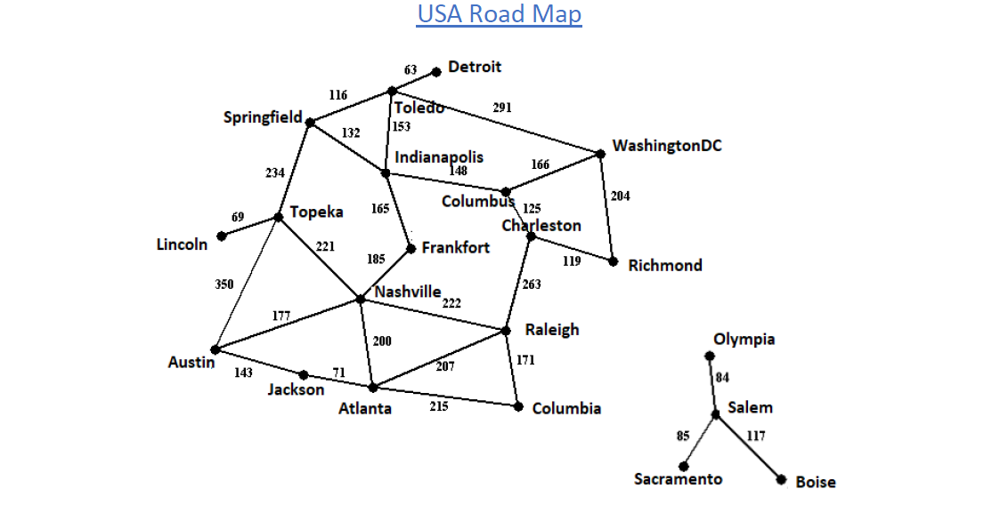

# Navigation
In this project I implemented four search algorithms to find paths between two locations on the USA road map below.

The four search algorithms I implmented were a simple DFS (Depth First Search) AND BFS (Breadth First Search) as well as a UCS (Uniform Cost Search) and an A-Star Search using made up heuristics.

You can run project by cloning this repository, then navigating to the folder and executing: 
find_path.py "Algorithm" input_file1.txt "City1" "City2"

Where find_path.py is the algorithm file I created and input_file1.txt is the map above, in text form. The map file gives paths to adjacent cities and the distances of such.

For example if we wanted to know the best path and distance using UCS from Columbia to WashingtonDC we would write:
find_path.py UCS input_file1.txt Columbia WashingtonDC

Which would output:

distance: 725 mi

path:
Columbia to Raleigh: 171 mi
Raleigh to Charleston: 263 mi
Charleston to Columbus: 125 mi
Columbus to WashingtonDC: 166 mi

The same execution can be used for a DFS AND BFS by just simply changing the Algorithm name in the command line and the cities you would like to traverse to and from.

If you want to use the A-Star search you must add another argument which is a heuristic text file to the command line.

For example:

find_path.py astar input_file1.txt Columbia WashingtonDC heuristic_Frankfort.txt

Where heuristic_Frankfort.txt provides somewhat arbitrary heuristics for each city in the map.
